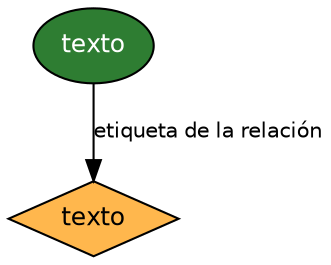
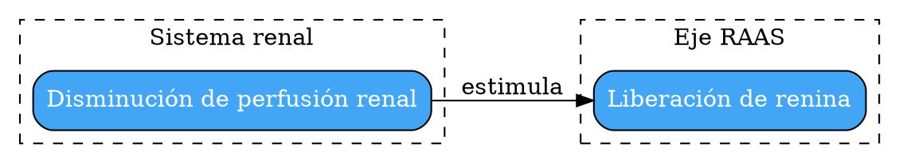

# Guía rápida de Graphviz (DOT) para algoritmos y esquemas clínicos

Graphviz (`dot`) es el motor de esta skill para todo lo que sea flujograma,
algoritmo de decisión o esquema de relaciones (fisiopatología, mecanismo de
acción). Está preinstalado en el sandbox y no depende de un navegador, a
diferencia de Mermaid CLI (que requiere Chrome headless y falla sin permisos
de root). Renderiza con `scripts/render_dot.sh`.

Partir siempre de `assets/plantilla_algoritmo.dot` y adaptar — no reinventar
la convención de colores/formas cada vez.

## Estructura mínima

## Convención de formas (mantener siempre)

| Tipo de paso | shape | color | Uso |
|---|---|---|---|
| Inicio / fin / conducta final | `oval` | verde `#2E7D32` | Punto de entrada o desenlace del algoritmo |
| Decisión | `diamond` | ámbar `#FFB74D` | Siempre redactada como pregunta con umbral citado |
| Acción / estudio | `box, style="rounded,filled"` | azul `#42A5F5` | Paso intermedio, orden de laboratorio, conducta |
| Alarma / criterio de hospitalización o UCI | `box, style="rounded,filled"` | rojo `#E57373` | Resaltar visualmente los criterios de gravedad |

## Fisiopatología / mecanismos (relaciones causales, no secuenciales)

Para esquemas de mecanismo (ej. cascada inflamatoria, vía RAAS), usar
`rankdir=LR` y agrupar por sistema con `subgraph cluster_X`:

Los clusters ayudan a que el residente vea de un vistazo qué sistema está
involucrado en cada parte del mecanismo.

## Líneas de tiempo con Graphviz (alternativa a matplotlib)

Si la línea de tiempo tiene ramificaciones (ej. varias guías que evolucionan
en paralelo), usar Graphviz con `rankdir=LR` y nodos en cadena. Si es una
línea de tiempo simple sin ramificaciones, es más simple usar
`scripts/chart_style.py::timeline()` (ver `chart-types-guia.md`).

## Errores comunes

- Olvidar `fontcolor=white` en nodos con relleno oscuro (el texto negro se
  vuelve ilegible sobre azul/verde/rojo oscuro).
- Etiquetas de decisión sin el umbral exacto ("¿está mal?" en vez de "¿TFGe
  < 60 mL/min/1.73m² por ≥ 3 meses?"). El algoritmo debe ser reproducible por
  otro residente sin ambigüedad.
- No incluir el nodo de fuente al pie (ver plantilla). Un algoritmo clínico
  sin fuente citada no cumple el filtro de realidad del usuario.
- Generar el diagrama en texto/prosa ("el algoritmo dice que primero se hace
  X, luego si Y entonces Z...") en vez de producir el archivo .dot y
  renderizarlo. El objetivo de esta skill es siempre entregar la imagen, no
  la descripción de la imagen.
